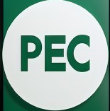
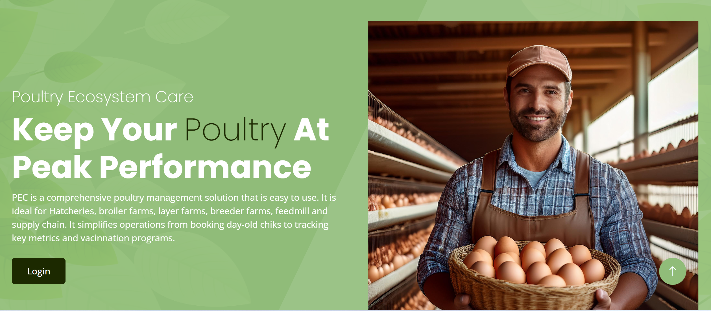

<a href="https://pec-assist-deploy.onrender.com//">
    
</a>

# Poultry Ecosystem Care

[PEC](https://pec-assist-deploy.onrender.com) is a web-based solution designed to simplify Poultry business operations for poultry farmers, hatcheries, middlemen and feed mill operators. Our MVP currently focuses on two primary features: a registration/login system and a day-old chick booking system.

* [Deployed site](https://pec-assist-deploy.onrender.com)
* [Blog Article](https://www.linkedin.com/posts/cherishegoyibo_building-a-poultry-management-platform-trials-activity-7242155221525684224-u97d?utm_source=share&utm_medium=member_desktop)
* [Author Linkedln](www.linkedin.com/in/cherishegoyibo)




## Table Of Content

- [Installation](#installation)
- [Usage](#usage)
- [Contributing](#contributing)
- [Inspiration](#inspiration)
- [Technology](#technology)
- [Related Projects](#related_projects)
- [Problem Statement](#problem_statement)
- [License](#license)
- [Links](#links)


## Installation

To run this project locally, follow these steps:

1. Clone the repository:

```bash
git clone https://github.com/yourusername/poultry-management-platform.git
```

2. Change to the project directory:

```bash
cd poultry-management-platform
```

3. Create a virtual environment:

```bash
python3 -m venv venv
```

4. Acitivate the virtual environment:
	
* On windows:
```bash
venv\Scripts\activate
```

* On macOS/Linux:
```bash
source venv/bin/activate
```
5. Install dependencies:

```bash
pip install -r requirements.txt
```

6. Run the application:

```bash
flask run
```
The app will run on http://localhost:5000/


## Usage

* **Primary Users:** Poultry farmers looking to optimize operation.
* **Secondary Users:** Hatcheries, Feed mills and Middlemen.

Our initial MVP has laid the foundation for a more comprehensive system. While we started with basic functionality, future iterations will scale to include inventory management, financial tracking, and automated communication between stakeholders.

## Contributing

We welcome contributions from the community! Here's how you can get involved:

1. Fork this repository

2. Create a branch:

```bash
git checkout -b feature-name
```

3. Make your changes and commit them:

```bash
git commit -m "Description of changes"
```

4. Push to the branch:
```bash
git push origin feature-name
```

5. Submit a pull request and we'll review it as soon as possible!


## Inspiration

I’m an animal scientist passionate about improving operations in the livestock industry. With years of experience in process management, I aim to create scalable, user-friendly tech solutions to address practical challenges. Projects like this excite me because they have a direct, positive impact on livelihoods.

## Technology

For the backend we used flask, a lightweight web framework for python. We choose flask because it's flexible and offers the ability to scale up. For the database we used SQLAlchemy while for the frontend we used HTML5 to structure the content of web pages, CSS for styling and JS for interactive features

## Related Projects
Poultrify
Livestockpro

## Problem Statement

Poultry farmers in Nigeria are currently experiencing high cost of operation and face a greater risk of business failure. This can be directly linked to feed inefficiency, disease outbreak, poor management system, lack of access to specialized knowledge and innovative practices which reduces profitability. This project aims to bridge the gap by providing professional solutions than enhance productivity, improve flock health, and ensure economic viability of poultry farming operations What the project will not solve While the project will provide comprehensive support to poultry farmers, it will not directly address broader agricultural challenges outside the poultry sector, such as crop farming or livestock other than poultry. The project will also not solve issues related to the overall agricultural policy framework or infrastructure deficits in Nigeria, such as transportation and market access challenges. Additionally, it will not provide direct financial support or subsidies to farmers but will focus on offering expert guidance and technological solutions to optimize existing resources.

## License

This project is licensed under the MIT License

## Links

* [Web site](https://pec-assist-deploy.onrender.com)
* [Blog](https://www.linkedin.com/posts/cherishegoyibo_building-a-poultry-management-platform-trials-activity-7242155221525684224-u97d?utm_source=share&utm_medium=member_desktop)
* [Contributing](https://github.com/baydre)
* [Source code](https://github.com/cherishegoyibo/pec)